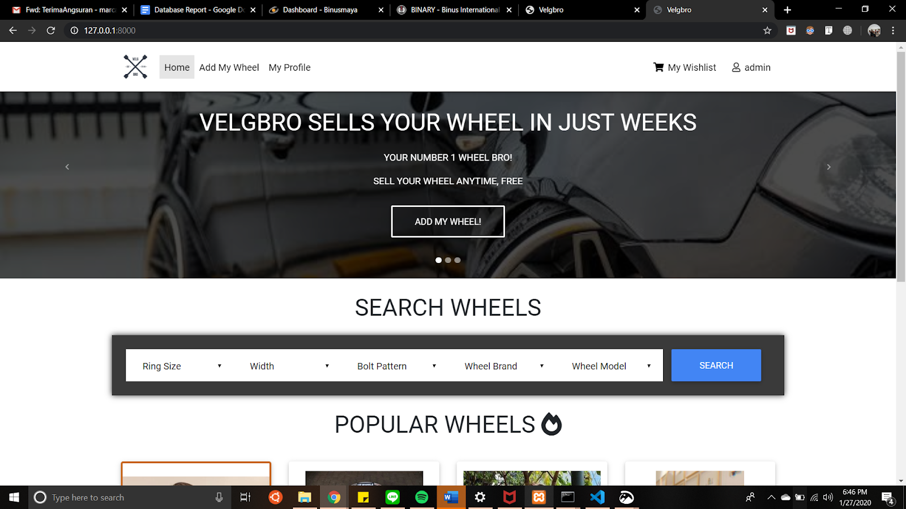
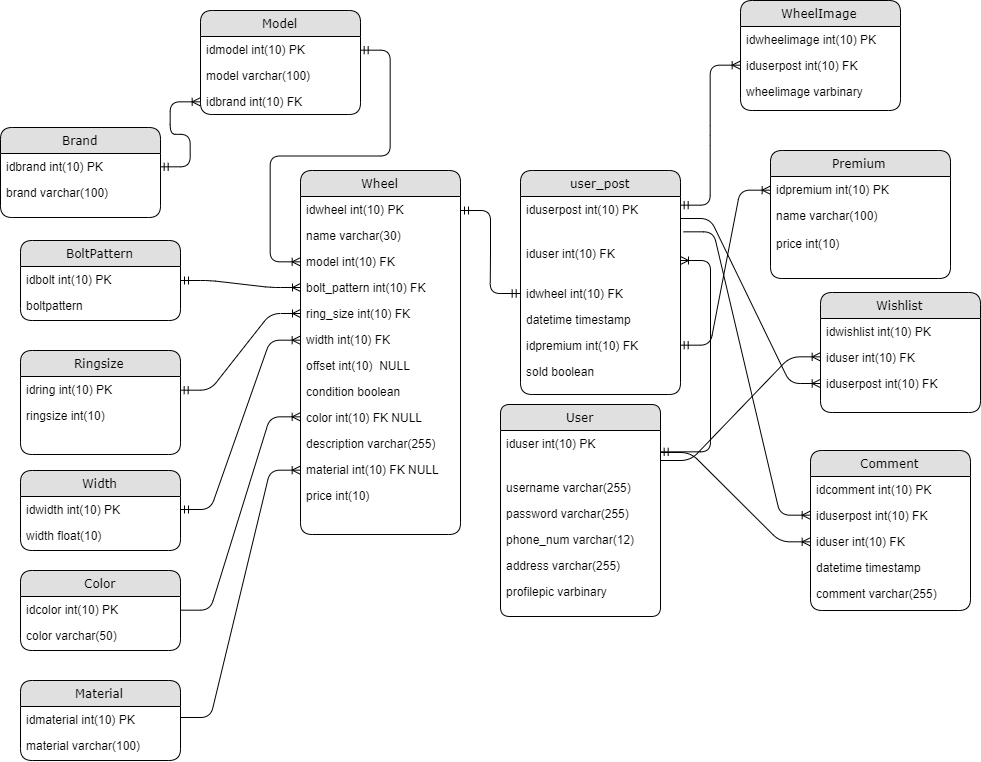

<p align="center">
  
</p>

--------------------------------------------------------------------

Web based car wheels selling platform, inspired by mobil123.com.

Created for Database Systems final project.

Team members:
* Amartya Kadarisman
* MarcAntonio Purnama
* Marcell Septian
* Figo Aranta



## Entity Relationship Diagram (ERD)



## How to Install
1. Clone or download zip of Velgbro.

`$ git clone https://github.com/amartya18/velgbro.git`

2. Install required libraries

`$ pip install -r requirements.txt`

3. Migrate the tables into the database
```
$ python manage.py makemigrations
$ python manage.py migrate
```

4. Run the website on yoour localhost server
`$ python manage.py runserver`